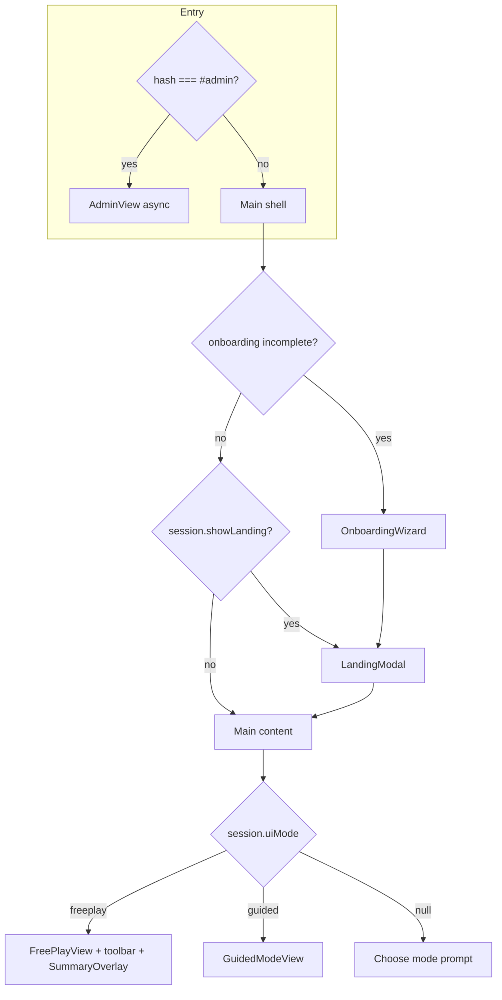

# UI flow and state boundaries

How screens compose, where Pinia state lives, and how Guided Mode uses DOM portals. Use this when tracing UX or comparing to `archive/legacy/`.

---

## High-level navigation (`App.vue`)

The root shell never passes game data down as props. **Views read Pinia stores directly** (`useSessionStore`, `useGuidedStore`, etc.). `App.vue` only orchestrates:

- **Which overlay** is visible (onboarding, landing, admin).
- **Which main column** is shown (freeplay stack vs `GuidedModeView`).
- **Local UI chrome**: preferences sidebar open, summary overlay open, play-mode accordion, body classes, save debounce.

### Visibility helpers (computed in `App.vue`)

| What you see | Typical condition |
|--------------|-------------------|
| `OnboardingWizard` | `!profile.onboardingComplete` **or** user reopened onboarding from preferences |
| `LandingModal` | Onboarding done, `session.showLanding`, not reopening onboarding |
| Main page (`PreferencesSidebar`, header, content card) | Landing dismissed **or** onboarding “tour preview” is active |
| `FreePlayView` | `session.uiMode === 'freeplay'` |
| `GuidedModeView` | `session.uiMode === 'guided'` |

Session start: `LandingModal` emits **choose** → `onChooseMode` → `session.startSession(mode)` (sets `uiMode`, clears landing). Guided header button also sets `uiMode` after optional `guided.resetAfterSessionComplete()`.

---

## Store ownership (what to open when debugging)

| Store | File | Owns |
|-------|------|------|
| Session | `stores/session.js` | Phase, roll count, max phase, landing flag, `uiMode`, `isGuidedMode` |
| Preferences | `stores/preferences.js` | Names, anatomy, voice, music, background image, prompt detail, etc. |
| Profile | `stores/profile.js` | Onboarding completion, suggested first mode |
| Guided | `stores/guided.js` | Guided config, timers, current prompt, breaks, TTS preload/cooking, session complete |
| Favorites | `stores/favorites.js` | Saved Phase 3 positions (guided) |
| Admin edits | *utils* `adminEdits.js` + `AdminView` | Phase 1/2/3 text and image overrides (not a Pinia store) |

**Persistence:** `loadState` / `saveState` (`utils/persistence.js`) sync session + preferences + guided snapshot to `localStorage` (`intimacyGameState`). `App.vue` watches a subset of fields and debounces saves.

**Speech / music:** `useSpeech()` and `useBackgroundMusic()` are composables. `App.vue` wires music callbacks into the preferences store; individual views call `useSpeech()` for speak / read-aloud.

---

## Components and data paths

| Component | Inputs | State / side effects |
|-----------|--------|----------------------|
| `FreePlayView` | *(none from App)* | Reads `session`, `preferences`; local roll fields; `useSpeech()` for read-aloud |
| `GuidedModeView` | *(none from App)* | Reads `guided`, `session`, `favorites`; drives flow via guided actions; teleports nav |
| `GuidedSetupWizard` | Embedded inside `GuidedModeView` when configuring | Writes guided config; teleports step bar + bottom nav |
| `PreferencesSidebar` | `open` prop, `@close` | Reads/writes `preferences`, `profile`; `@show-onboarding`, `@show-favorites` |
| `LandingModal` | `show`, `suggested-mode` | `@choose` → session start |
| `OnboardingWizard` | `show` | `@complete`, `@tour-preview` |
| `SummaryOverlay` | `open`, `@close` | Read-only tables from data + admin merges |
| `TimerBar` | *(none)* | Freeplay phase timer tied to session |
| `AdminView` | hash routing | Password gate; edits via `adminEdits.js` |

**Rule of thumb:** If you need “current phase” or “guided prompt,” use **stores**, not props through `App.vue`.

---

## DOM portals (Guided UX)

`App.vue` defines empty containers; children **teleport** UI into them so layout stays consistent (header → step bar → scrollable content → bottom nav).

| Target id | Fed by | Content |
|-----------|--------|---------|
| `#step-bar-portal` | `GuidedSetupWizard` | Wizard progress strip |
| `#bottom-nav-portal` | `GuidedModeView`, `GuidedSetupWizard` | Primary actions (Next, setup steps, cooking state) |

Global styles in `src/assets/styles.css` reference these targets (e.g. show step bar when it has content).

---

## Legacy → Vue map

When reading `archive/legacy/`, use this to find the modern owner (see also `archive/legacy/README.md`).

| Legacy file | Role in vanilla app | Vue / `src` counterpart |
|-------------|--------------------|-------------------------|
| `index-legacy.html` | Single-page shell + inline styles | `index.html`, `App.vue`, `assets/styles.css` |
| `main.js` | Boot, tab routing | `main.js`, `App.vue` |
| `state.js` | Global mutable state | `stores/session.js`, `preferences.js`, `profile.js`, `guided.js` |
| `free-play.js` | Dice game UI + rolls | `FreePlayView.vue`, `promptHelper.js`, `data/tables.js` |
| `guided-mode.js` | Guided timers and flow | `stores/guided.js`, `GuidedModeView.vue`, `GuidedSetupWizard.vue` |
| `clothing.js` | Clothing removal rolls | `data/clothing.js`, logic in guided / freeplay |
| `tables.js` | Phase 1/2/3 tables | `src/data/tables.js` (and phase3 from root `phase3-positions-data.js`) |
| `prompt-help.js` | Instruction text | `utils/promptHelper.js` |
| `speech.js` | TTS | `composables/useSpeech.js`, `workers/tts.worker.js` |
| `ui-helpers.js` | DOM helpers | Various Vue components / composables |
| `phase3-anatomy.js` | Anatomy tags | Folded into data / admin / prompts as needed |

---

## Suggested reading order for new contributors

1. This file (navigation + stores).
2. `App.vue` (computed visibility + watchers).
3. `stores/session.js` + `stores/guided.js` for play flow.
4. `GuidedModeView.vue` (template branches: setup vs running vs complete).
5. `FreePlayView.vue` for dice-only path.
